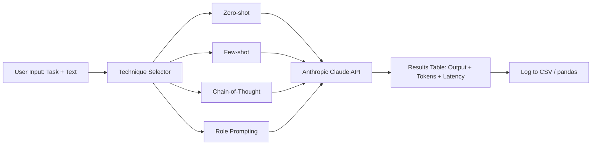

# 02 — Prompt Engineering Playground

## Problem Statement

Prompt engineering is still treated as guesswork by most teams. This tool makes it empirical: run the same business task through multiple prompting strategies side-by-side, log the outputs, and compare quality, cost, and latency — so you can make evidence-based decisions about which technique to use in production.

## Architecture



## Setup

```bash
cd 02-prompt-playground
python -m venv .venv
source .venv/bin/activate
pip install -r requirements.txt
cp .env.example .env
streamlit run app.py
```

## Usage

1. Choose a business task: customer feedback classification, invoice entity extraction, or ticket categorization
2. Enter your sample text
3. Select which prompt techniques to compare
4. Run all — results appear in a comparison table with outputs, token counts, and latency
5. Export results to CSV for analysis

## Business Value

- **Decision support:** Helps teams choose the right prompting strategy before building production pipelines
- **Cost visibility:** Shows token usage per technique to inform budget decisions
- **Knowledge transfer:** Makes prompt engineering teachable and reproducible for non-technical stakeholders

## What I Learned

- Systematic differences between zero-shot and few-shot on classification tasks
- Chain-of-thought tradeoffs: more tokens but often higher accuracy on ambiguous inputs
- How role prompting affects tone and format without changing core instructions

## Limitations & Future Work

- Add OpenAI GPT-4 as a second provider for cross-model comparison
- Persist experiment history with DuckDB or SQLite
- Add automatic scoring using an LLM-as-judge pattern
