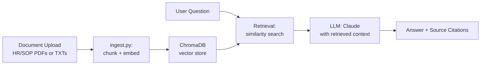

# 03 — Policy / SOP Q&A Bot

## Problem Statement

Every large organisation drowns in policy documents — HR handbooks, SOPs, compliance manuals — that employees can't efficiently search. This chatbot lets anyone ask a natural language question and get a precise, cited answer grounded in the actual documents, eliminating the "email HR and wait three days" problem.

## Architecture



## Setup

```bash
cd 03-policy-qa-rag
python -m venv .venv
source .venv/bin/activate
pip install -r requirements.txt
cp .env.example .env

# Ingest documents first
python ingest.py --docs_dir ./sample_docs

# Then launch the chat UI
streamlit run app.py
```

## Usage

1. Run `ingest.py` to load and embed your documents into ChromaDB
2. Launch the Streamlit app
3. Ask questions in the chat interface
4. Each answer includes source document references and relevant excerpts

## Business Value

- **Time saved:** Eliminates 2–5 minute searches per policy question across teams
- **Accuracy:** Grounded answers reduce misinformation from memory or outdated docs
- **Audit trail:** Every query and source citation is logged for compliance review

## What I Learned

- Chunking strategy trade-offs: fixed-size vs. sentence-aware vs. semantic chunking
- ChromaDB persistence and collection management
- Citation formatting: surfacing the source chunk alongside the answer
- Context window management when multiple chunks are retrieved

## Limitations & Future Work

- Currently supports PDF and TXT; add DOCX support
- Add re-ranking step (cross-encoder) to improve retrieval precision
- Multi-collection support for different departments
