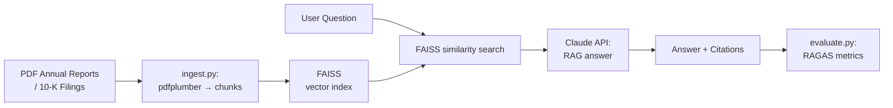

# 04 — Financial Report Analyst (RAG over PDFs)

## Problem Statement

Analysts spend hours manually reading 200-page annual reports and 10-K filings to extract key insights. This tool ingests those PDFs, builds a searchable index, and lets users ask specific questions — with evaluation metrics to validate answer quality.

## Architecture



## Setup

```bash
cd 04-financial-report-rag
python -m venv .venv
source .venv/bin/activate
pip install -r requirements.txt
cp .env.example .env

# Ingest PDFs
python ingest.py --pdf_dir ./sample_pdfs

# Launch Q&A app
streamlit run app.py

# Run evaluation (optional)
python evaluate.py
```

## Usage

1. Drop PDF annual reports into `sample_pdfs/`
2. Run ingestion to build the FAISS index
3. Ask questions like:
   - "What were the key risk factors mentioned?"
   - "Summarise the revenue trend over the past 3 years"
   - "What is the company's debt-to-equity position?"

## Business Value

- **Time saved:** Reduces manual PDF reading from hours to seconds per query
- **Accuracy tracking:** RAGAS evaluation makes answer quality measurable
- **Scale:** Works across multiple filings simultaneously

## What I Learned

- PDF text extraction nuances with pdfplumber (tables, headers, footers)
- FAISS index creation, serialisation, and loading
- RAGAS evaluation framework: faithfulness, answer relevance, context precision, context recall
- Chunking strategies for financial documents (section-aware vs. fixed-size)

## Limitations & Future Work

- Tables in PDFs often extract poorly — add specialised table extraction
- Add multi-document comparison: "How did revenue differ between Company A and B?"
- Integrate LangSmith for tracing and debugging retrieval quality
