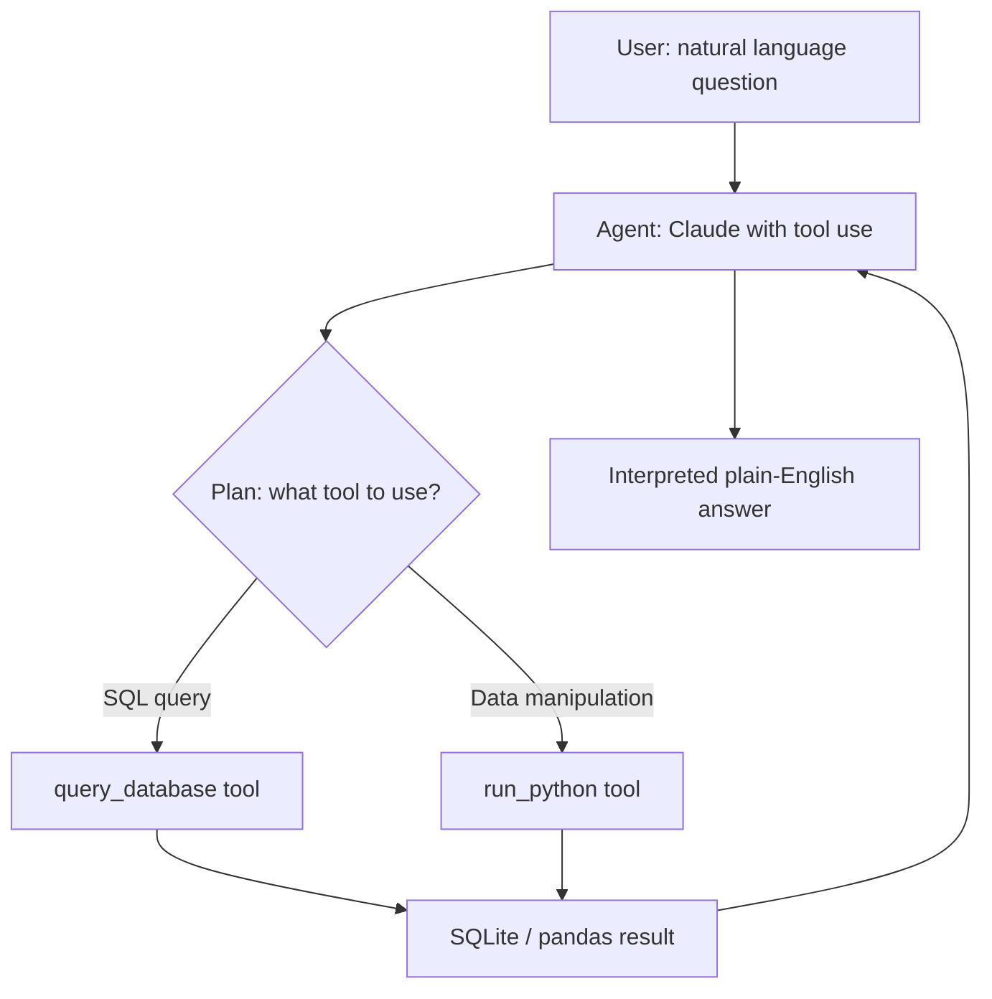

# 05 — Data Analyst Agent

## Problem Statement

A business analyst's core job is answering data questions. This agent does that autonomously: given a natural language question about a dataset, it decides what SQL or Python code to write, executes it, interprets the result, and responds in plain English. It's the AI version of the BA day job.

## Architecture



## Setup

```bash
cd 05-data-analyst-agent
python -m venv .venv
source .venv/bin/activate
pip install -r requirements.txt
cp .env.example .env

# Load sample data into SQLite
python setup_db.py

# Launch the agent UI
streamlit run app.py
```

## Usage

Sample questions to try:
- "Which region had the highest revenue growth quarter-over-quarter?"
- "What are the top 5 products by return rate?"
- "Show me months where sales dropped more than 10% compared to the previous month"
- "What is the average order value by customer segment?"

## Business Value

- **Productivity:** Reduces time-to-insight from hours (ticket-based BI requests) to seconds
- **Self-service:** Enables non-technical stakeholders to query data without SQL knowledge
- **Auditability:** All generated code is shown and logged for review

## What I Learned

- Anthropic tool use API: defining tools as JSON schemas and handling tool_use blocks
- ReAct pattern: reason → act → observe → reason again
- Safe code execution patterns (sandboxing Python with restricted globals)
- Interpreting execution results back into natural language

## Limitations & Future Work

- Currently uses SQLite; add PostgreSQL/BigQuery connectors
- Add chart generation (Matplotlib/Plotly) as an additional tool
- Memory: agent doesn't remember previous questions in the session yet
