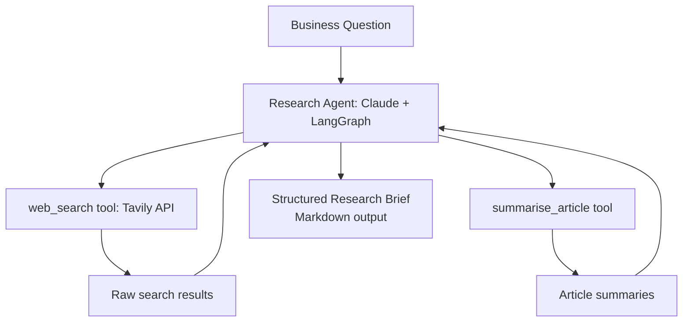

# 06 — Multi-Source Research Agent

## Problem Statement

Business research — competitive analysis, market sizing, regulatory scanning — takes days of manual web searching, reading, and synthesis. This agent takes a business question, searches the web autonomously, summarises relevant sources, cross-references findings, and produces a structured research brief in minutes.

## Architecture



## Setup

```bash
cd 06-research-agent
python -m venv .venv
source .venv/bin/activate
pip install -r requirements.txt
cp .env.example .env  # add ANTHROPIC_API_KEY and TAVILY_API_KEY

streamlit run app.py
```

Get a free Tavily API key at https://tavily.com

## Usage

Sample research questions:
- "What is the competitive landscape for EV charging infrastructure in India?"
- "What are the main regulatory risks for fintech lending in Southeast Asia?"
- "Summarise recent trends in enterprise AI adoption in the healthcare sector"

Output: a structured markdown brief with Executive Summary, Key Findings, Sources, and Knowledge Gaps.

## Business Value

- **Time saved:** Hours of manual research compressed to under 5 minutes
- **Completeness:** Agent plans searches iteratively — not just one search
- **Citation hygiene:** Every claim is traceable to a source URL

## What I Learned

- Tavily API for LLM-optimised web search
- Multi-step agent planning: the agent decides how many searches are sufficient
- Deduplication of sources across multiple search queries
- Structuring LLM output as a formal research deliverable

## Limitations & Future Work

- Free Tavily tier limits search depth — upgrade for production use
- Agent doesn't yet distinguish between primary and secondary sources
- Add PDF export of the research brief
