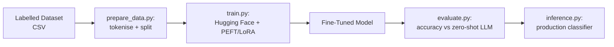

# 07 — Domain-Specific Text Classifier (Fine-Tuned)

## Problem Statement

Zero-shot LLMs are powerful but expensive and slow for high-volume classification tasks. When you need to classify thousands of support tickets or financial news items per day, a fine-tuned small model is faster, cheaper, and more consistent. This project fine-tunes DistilBERT (or Mistral-7B with QLoRA) on a business document classification task and benchmarks it against zero-shot Claude.

## Architecture



## Setup

```bash
cd 07-fine-tuned-classifier
python -m venv .venv
source .venv/bin/activate
pip install -r requirements.txt
cp .env.example .env

# Prepare and train (GPU recommended for Mistral; CPU works for DistilBERT)
python prepare_data.py
python train.py

# Evaluate fine-tuned vs zero-shot
python evaluate.py

# Run inference on new text
python inference.py --text "Server down, all users affected, cannot login"
```

## Usage

The default task classifies IT support tickets into categories:
`Hardware | Software | Network | Access | Billing | Other`

To adapt to your own dataset, replace `data/tickets.csv` with your labelled CSV (columns: `text`, `label`).

## Business Value

- **Speed:** Fine-tuned DistilBERT classifies ~500 tickets/second vs. ~2/second with an LLM API
- **Cost:** Eliminates per-token API cost for high-volume classification
- **Accuracy:** Domain-specific fine-tuning typically adds 10–20% accuracy vs. zero-shot on narrow tasks

## What I Learned

- LoRA/QLoRA: parameter-efficient fine-tuning — trains only ~1% of model parameters
- Hugging Face `Trainer` API and `datasets` library workflow
- When NOT to fine-tune: for low-volume or rapidly-changing label sets, RAG + LLM is better
- Weights & Biases for training run tracking

## Limitations & Future Work

- Training data is synthetic — replace with real labelled tickets for production use
- Add multi-label classification support
- Export to ONNX for faster CPU inference in production
