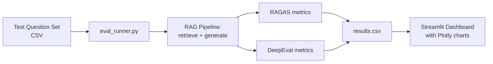

# 08 — RAG Evaluation Dashboard

## Problem Statement

Most GenAI portfolios show impressive demos but zero measurement. This project adds rigorous evaluation to the RAG pipeline from Project 3 or 4, measuring faithfulness, answer relevance, context precision, and context recall — then displays results on an interactive dashboard. This is the portfolio piece that separates builders from engineers.

## Architecture



## Setup

```bash
cd 08-rag-eval-dashboard
python -m venv .venv
source .venv/bin/activate
pip install -r requirements.txt
cp .env.example .env

# Run evaluation (connects to the policy QA RAG from project 03)
python eval_runner.py --questions ./test_questions.csv --output ./results.csv

# Launch dashboard
streamlit run app.py
```

## Usage

1. Edit `test_questions.csv` with your domain-specific test questions
2. Run `eval_runner.py` to generate answers and compute metrics
3. Open the Streamlit dashboard to explore results
4. Identify weak spots: low-scoring questions reveal retrieval or generation failures

## Business Value

- **Quality assurance:** Makes RAG accuracy measurable and comparable across pipeline versions
- **Regression detection:** Re-run after any pipeline change to catch quality degradation
- **Stakeholder credibility:** Shows measured performance, not just anecdotal demos

## What I Learned

- RAGAS metric definitions: faithfulness (hallucination detection), answer relevancy, context precision and recall
- DeepEval for additional metrics and test case management
- The importance of a curated test set: garbage questions = garbage metrics
- How to visualise multi-dimensional eval results to find actionable insights

## Limitations & Future Work

- RAGAS requires an LLM to score metrics (adds cost) — add caching
- Add human evaluation scores alongside automated metrics
- Track metrics over time with a SQLite history table
