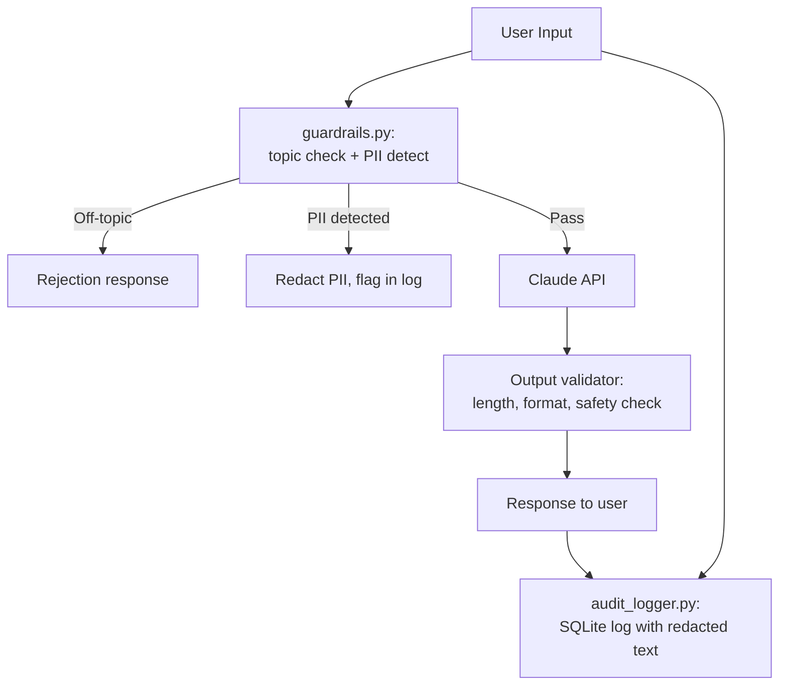

# 09 — Guardrailed Enterprise Chatbot

## Problem Statement

Most GenAI demos are open-ended and unsafe for enterprise deployment. Real enterprise chatbots need: input validation, topic restriction (stays on-domain), PII detection and redaction before logging, output validation, and a full audit trail. This project builds all of that.

## Architecture



## Setup

```bash
cd 09-guardrailed-chatbot
python -m venv .venv
source .venv/bin/activate
pip install -r requirements.txt
cp .env.example .env

streamlit run app.py
```

## Usage

The chatbot is configured as an HR policy assistant (using the sample docs from project 03). It will:
- Refuse off-topic questions (not about HR/company policy)
- Detect and redact PII (emails, phone numbers, names) before saving logs
- Validate that responses are within expected length and don't contain inappropriate content
- Log every interaction to SQLite for audit review

## Business Value

- **Compliance:** Full audit log satisfies data governance requirements
- **Risk reduction:** Topic restriction prevents reputational and legal exposure
- **Privacy:** PII is never stored in plaintext in audit logs

## What I Learned

- Regex-based PII detection as a lightweight alternative to ML-based NER
- Topic classification with a small LLM call as a guard layer
- SQLite for structured, queryable audit logging
- Output validation patterns: length checks, keyword blocklists, format verification

## Limitations & Future Work

- PII detection is regex-based — upgrade to a dedicated NER model for production
- Add rate limiting per user session
- Integrate with Guardrails AI for declarative output schema validation
