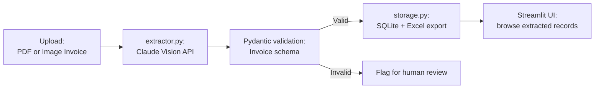

# 10 — Invoice / Document Intelligence Pipeline

## Problem Statement

Finance and operations teams manually key in data from invoices, receipts, and purchase orders — a slow, error-prone process that costs enterprises thousands of staff-hours per year. This pipeline uses Claude's vision capability to extract structured fields from scanned documents, validates the output against a Pydantic schema, and stores results in a database or spreadsheet.

## Architecture



## Setup

```bash
cd 10-document-intelligence
python -m venv .venv
source .venv/bin/activate
pip install -r requirements.txt
cp .env.example .env

streamlit run app.py
```

## Usage

1. Upload an invoice image (PNG, JPG) or PDF via the Streamlit UI
2. Claude Vision extracts: vendor name, invoice date, invoice number, line items, subtotal, tax, total
3. Extracted data is validated against the Pydantic `Invoice` schema
4. Valid records are saved to SQLite and can be exported to Excel
5. Invalid records are flagged for manual review with the specific validation error

## Business Value

- **Speed:** Processes a 2-page invoice in under 5 seconds vs. 5–10 minutes manually
- **Accuracy:** Vision LLM handles varied layouts without template configuration
- **Scale:** Processes hundreds of invoices per hour with batch mode
- **Auditability:** Original document stored alongside extracted data

## What I Learned

- Anthropic Claude vision API: encoding images as base64 for multimodal messages
- Pydantic v2 model validation for structured LLM output
- Prompting for JSON extraction: using structured output with explicit schema instructions
- SQLite for lightweight relational storage without a server

## Limitations & Future Work

- Multi-page PDF support is limited by image quality after conversion
- Add confidence scores per extracted field
- Build a correction UI so humans can fix and re-save rejected records
- Batch processing mode for folder-based ingestion
